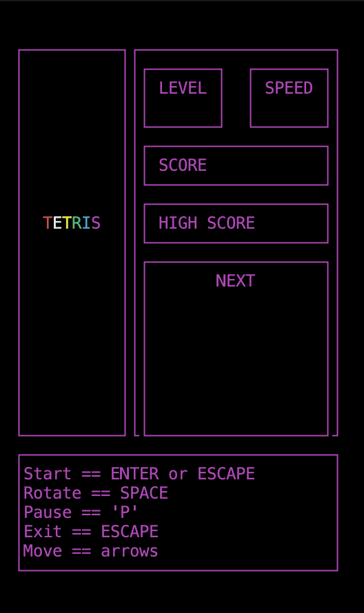

# BrickGame
В данном проекте реализована игра «Тетрис» на языке программирования С с использованием структурного подхода

Консольный интерфейс реализован следующим образом:

## Введение

Для реализации игры «Тетрис» проект должен состоять из двух частей: библиотеки, реализующей логику работы игры, которую можно подключать к различным GUI в будущем, и терминального интерфейса, разработанного с использованием библиотеки `ncurses`. Логика работы библиотеки должна быть реализована с использованием конечных автоматов, одно из возможных описаний которого будет дано ниже.

Для формализации логики данной игры представлен следующий вариант конечного автомата:

## Требования к проекту

### Часть 1. Основное задание

- Программа должна быть разработана на языке Си стандарта C11 с использованием компилятора gcc.
- Программа должна состоять из двух частей: библиотеки, реализующей логику игры тетрис, и терминального интерфейса с использованием библиотеки `ncurses`.
- Для формализации логики игры должен быть использован конечный автомат.
- Библиотека должна иметь функцию, принимающая на вход ввод пользователя, и функцию, выдающую матрицу, которая описывает текущее состояние игрового поля, при каждом ее изменении.
- Код библиотеки программы должен находиться в папке `src/brick_game/tetris`.
- Код с интерфейсом программы должен находиться в папке `src/gui/cli`.
- Сборка программы должна быть настроена с помощью Makefile со стандартным набором целей для GNU-программ: all, install, uninstall, clean, dvi, dist, test, gcov_report. Установка должна вестись в любой другой произвольный каталог.
- Программа должна быть разработана в соответствии с принципами структурного программирования.
- При написании кода придерживайся Google Style.
- Должно быть обеспечено покрытие библиотеки unit-тестами, с помощью библиотеки `check` (тесты должны проходить на ОС Darwin/Ubuntu). Покрытие библиотеки с логикой игры тестами должно составлять не меньше 80 процентов.
- В игре должны присутствовать следующие механики:
  - Вращение фигур;
  - Перемещение фигуры по горизонтали;
  - Ускорение падения фигуры (при нажатии кнопки фигура перемещается до конца вниз);
  - Показ следующей фигуры;
  - Уничтожение заполненных линий;
  - Завершение игры при достижении верхней границы игрового поля;
  - В игре должны присутствовать все виды фигур, показанных на картинке ниже.
- Для управления добавь поддержку всех кнопок, предусмотренных на физической консоли:
  - Начало игры,
  - Пауза,
  - Завершение игры,
  - Стрелка влево — движение фигуры влево,
  - Стрелка вправо — движение фигуры вправо,
  - Стрелка вниз — падение фигуры,
  - Стрелка вверх — ни используется в данной игре,
  - Действие (вращение фигуры).
- Игровое поле должно соответствовать размерам игрового поля консоли — десять «пикселей» в ширину и двадцать «пикселей» в высоту.
- Фигура, после достижения нижней границы поля или соприкосновения с другой фигурой, должна остановиться. После этого происходит генерация следующей фигуры, показанной на превью.
- Интерфейс библиотеки должен соответствовать описанию, которое находится в materials/library-specification.md.
- Пользовательский интерфейс должен поддерживать отрисовку игрового поля и дополнительной информации.
- Подготовь в любом формате диаграмму, описывающую используемый КА (его состояния и все возможные переходы).

Используемые фигуры:

### Часть 2. Дополнительно. Подсчет очков и рекорд в игре

Добавь в игру следующие механики:

- подсчет очков;
- хранение максимального количества очков.

Данная информация должна передаваться и выводиться пользовательским интерфейсом в боковой панели. Максимальное количество очков должно храниться в файле или встраиваемой СУБД и сохраняться между запусками программы.

Максимальное количество очков должно изменяться во время игры, если пользователь во время игры превышает текущий показатель максимального количества набранных очков.

Начисление очков будет происходить следующим образом:

- 1 линия — 100 очков;
- 2 линии — 300 очков;
- 3 линии — 700 очков;
- 4 линии — 1500 очков.

### Часть 3. Дополнительно. Механика уровней
Добавь в игру механику уровней. Каждый раз, когда игрок набирает 600 очков, уровень увеличивается на 1. Повышение уровня увеличивает скорость движения фигур. Максимальное количество уровней — 10.
